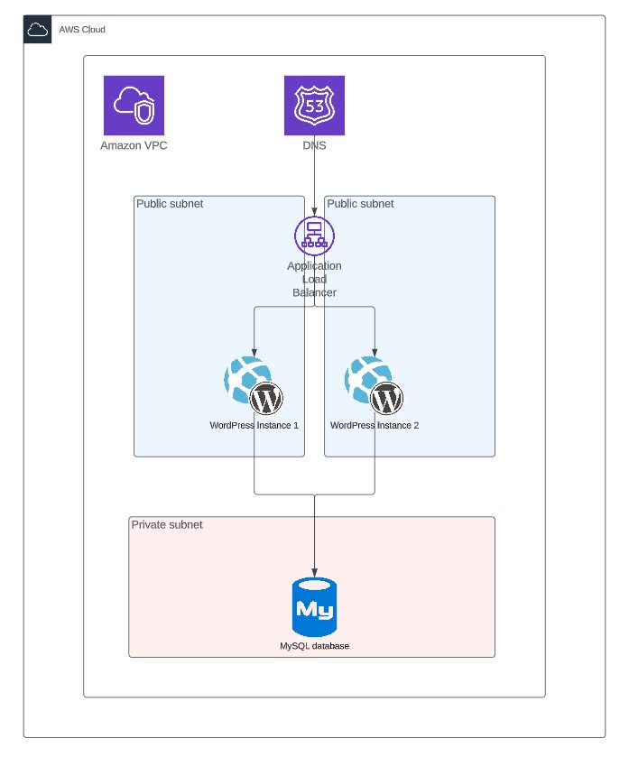
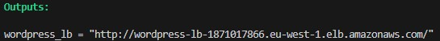

# Wordpress deployment to AWS
### via Terraform and Ansible


## Prerequisites

Before using this Makefile, ensure you have the following:

- [Terraform](https://www.terraform.io/downloads.html) installed and available in your system's PATH.
- [make](https://wiki.ubuntu.com/ubuntu-make) installed
- Valid AWS credentials exported as environment variables:
  - `AWS_ACCESS_KEY_ID`: Your AWS access key.
  - `AWS_SECRET_ACCESS_KEY`: Your AWS secret access key.

## Usage

To apply the Terraform configuration for either EC2 or ECS, run the following command:

```bash
make apply
```
The Makefile will initialize the Terraform configuration and apply the changes accordingly.

You will be asked to manually type the following credentials:
```bash
db_user # Wordpress database user
db_pass # Wordpress database password 
wp_user # Wordpress administration console user
wp_pass # Wordpress administration console password
```

If you'd like to completely automate the deployment, copy `terraform\terraform.tfvars.example` to `terraform\terraform.tfvars` and edit the credentials.

Once done, you'll see the Wordpress URL in the console:


## Destroy Terraform Resources
To destroy the Terraform resources, run the following command:

```bash
make destroy
```
The Makefile will initialize the Terraform configuration and destroy the resources accordingly. Terraform may ask you to provide credentials again, just press Enter for each.
